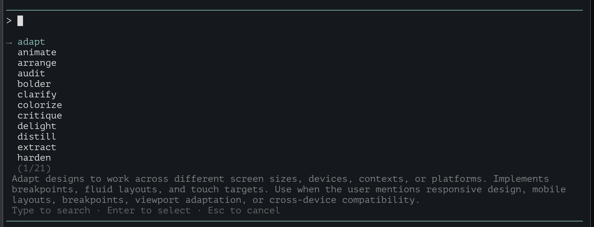
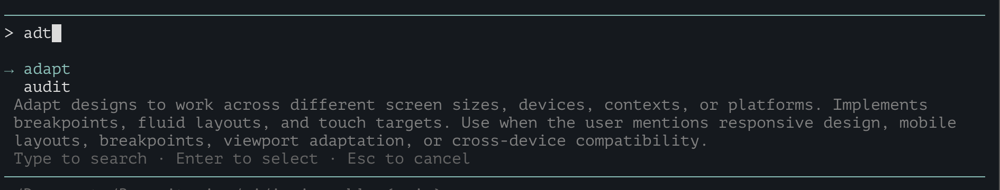
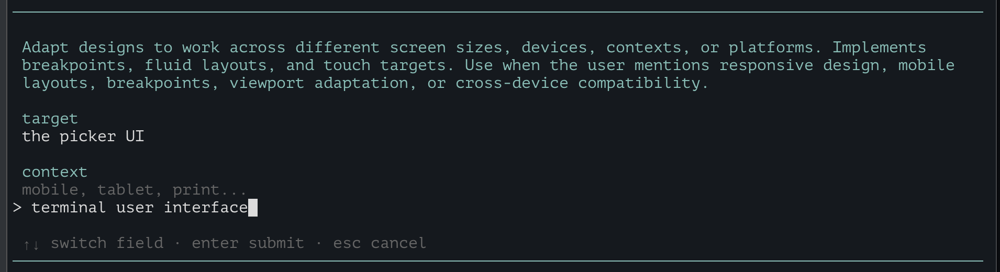

# Impeccable pi Extension

Standalone pi extension for [Impeccable](https://github.com/pbakaus/impeccable) commands plus a vendored local copy of `skills/frontend-design`.

Use commands directly:
```bash
# Recommended on first-use in a repo: one-time setup that gathers design context for your project and saves it to your AI config file. Run once to establish persistent design guidelines.
/impeccable teach-impeccable

/impeccable adapt
/impeccable adapt checkout mobile
/impeccable polish "settings page"
/impeccable critique dashboard
```
or via command picker & argument form via `/impeccable`:

- The picker includes all upstream commands plus a final built-in `skill: frontend-design` option that triggers the vendored frontend-design skill from this extension (without exposing a standalone `/skill:frontend-design` command).




## Install

#### pi default
```bash
pi install https://github.com/raunovillberg/im-pi-eccable
```
#### or via git source
```bash
pi install git:github.com/raunovillberg/im-pi-eccable
```
#### optionally pinned to a commit/tag
```bash
pi install git:github.com/raunovillberg/im-pi-eccable@<commit-or-tag>
```
#### or manual git clone
```
git clone https://github.com/raunovillberg/im-pi-eccable.git ~/.pi/agent/extensions/impeccable
```

Then restart pi or run `/reload` in an active session.

The extension entrypoint is `./index.ts`, command definitions are loaded from `./commands/*.md`, and command guidance resolves vendored skill paths from the extension directory at runtime (so it works in standalone extension installs).

## Refresh upstream files (commands + local frontend-design skill)

Upstream version synced: [`685728b`](https://github.com/pbakaus/impeccable/commit/685728b992e873be2d27cc187cf4cdc104582ae7) (2026-03-28)

Use the refresh script from the repository root:

```bash
./scripts/refresh-upstream.sh
```

What it does:
- pulls `source/skills/*/SKILL.md` from `pbakaus/impeccable` (each skill directory becomes a command)
- pulls `source/skills/*/reference/**` for vendored reference files (e.g. critique reference)
- pulls `source/skills/frontend-design/**`
- rewrites cross-skill slash-command invocations (`/impeccable frontend-design`, `/impeccable teach-impeccable`) to agent-actionable file-read instructions with placeholders resolved by `index.ts`:
  - `{{frontend_design_skill_path}}` — absolute path to vendored frontend-design SKILL.md
  - `{{frontend_design_reference_glob}}` — absolute glob for reference files
  - `{{teach_impeccable_path}}` — absolute path to teach-impeccable command
  - `{{available_commands}}` — comma-separated list of all commands
- fixes relative reference links in frontend-design to use absolute paths

Optional: use a different upstream fork/URL for testing:

```bash
UPSTREAM_REPO=https://github.com/<you>/impeccable.git ./scripts/refresh-upstream.sh
```

Note: this extension intentionally vendors `skills/frontend-design` as local files and references them directly from command markdown; it does **not** expose `frontend-design` as a separate pi skill.

## License & Attribution

- Licensed under Apache License 2.0 (`./LICENSE`)
- Attribution and upstream notices are in `./NOTICE.md`

When redistributing this standalone extension, include both files.
